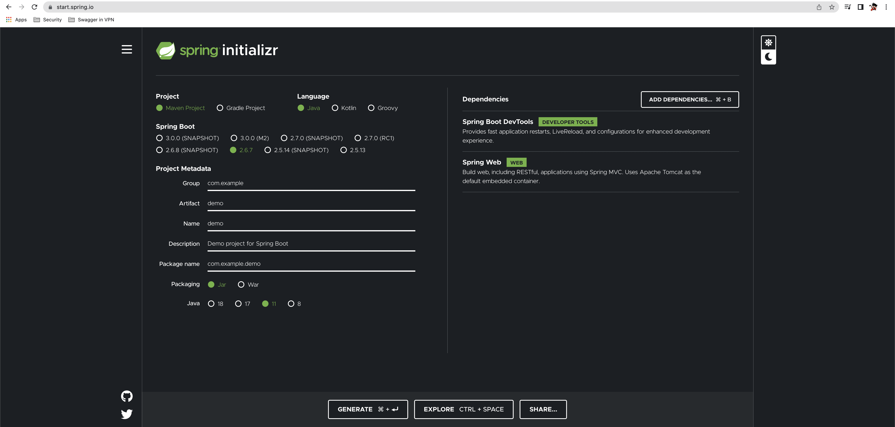
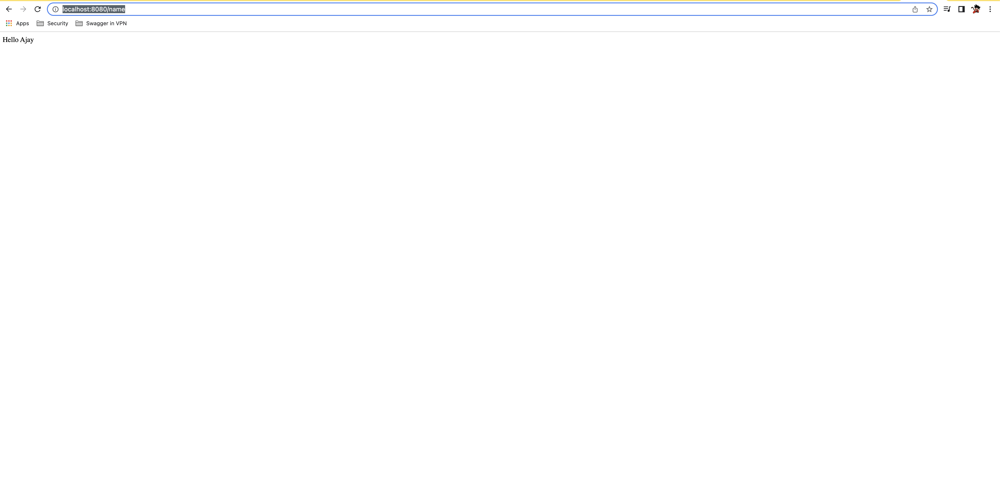

### SpringBoot + JSP Starter Kit

### Chapter-01 Signup Page
* Get Example SignUp page from https://mdbootstrap.com/docs/standard/extended/registration/ and put it in signup.jsp
Also add navbar item from : https://getbootstrap.com/docs/4.0/components/navbar/#color-schemes
* Add more dependencies to pom 
  1. Used to validate Beans (RegisterBean - SignUp details)
```xml
<dependency>
    <groupId>org.springframework.boot</groupId>
    <artifactId>spring-boot-starter-validation</artifactId>
</dependency>
```

2. JSP related tags to loop through items.
```xml
<!-- JSTL -->
<dependency>
    <groupId>javax.servlet</groupId>
    <artifactId>jstl</artifactId>
</dependency>
<dependency>
    <groupId>taglibs</groupId>
    <artifactId>standard</artifactId>
    <version>1.1.2</version>
</dependency>
```
* Added `/registerUser` POST method which takes SignUp form details , verifies the data and upon error redirects to signup page and upon success redirects to index page.
* Test Signup page at http://localhost:8080/signup
### STARTER KIT: 
#### This project shows step-by-step guide to start a JSP Project with SpringBoot.

* Follow the instructions to start from scratch.
* Navigate to https://start.spring.io and select latest stable Spring Boot version.
* Select Java Version as per your need and select jar.
* In dependencies, add Spring Web and Spring DevTools.


* Additionally add 	the below dependency to pom to initialize jsp pages:
```xml
  <dependency>  
  <groupId>org.apache.tomcat.embed</groupId>  
  <artifactId>tomcat-embed-jasper</artifactId>  
  </dependency>
  ```
* resources/application.properties should have jsp source locations:

> server.servlet.contextPath=/  
spring.mvc.view.prefix=/WEB-INF/jsp/  
spring.mvc.view.suffix=.jsp  
server.servlet.encoding.charset=UTF-8  
server.servlet.encoding.enabled=true  
server.servlet.encoding.force=true  

* Create a basic Controller and jsp page as shown in the code.
* Then Test the App at http://localhost:8080/name after successful build and Execution as below:



